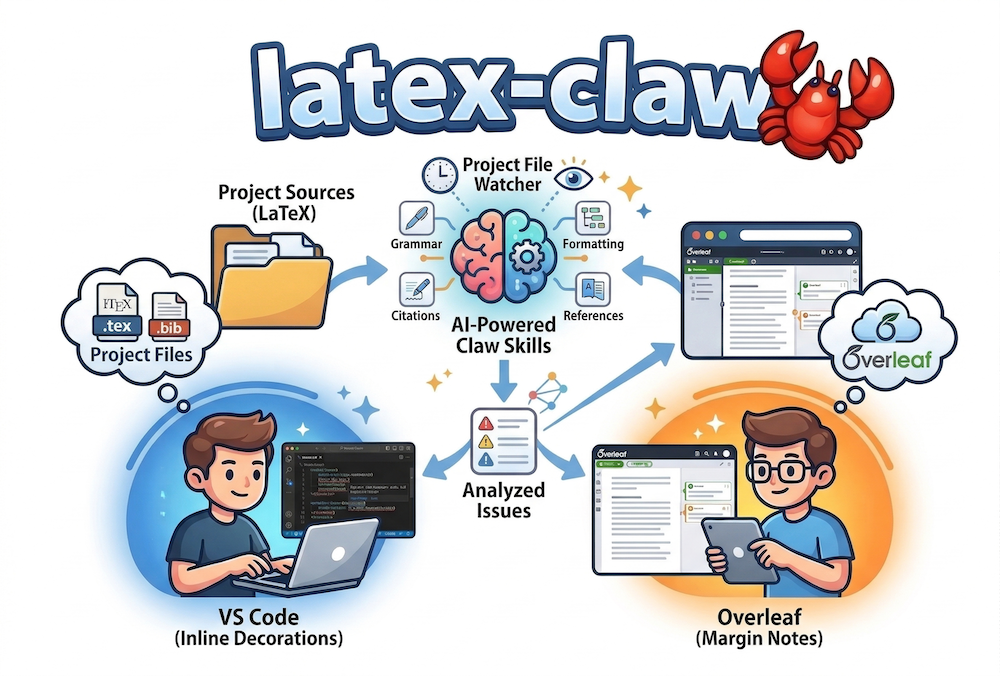

<div align="center">
  
  <h1>🦞 latex-claw</h1>
  <p><strong>Live academic paper analysis while you write</strong></p>
  <p>
    <code>latex-claw</code> watches your LaTeX project, runs analysis skills across sections, and surfaces issues as inline decorations in VS Code or margin annotations in Overleaf — without leaving your editor.
  </p>
  <p>
    <a href="https://github.com/just-claw-it/latex-claw/actions/workflows/ci.yml">
      
    </a>
    <a href="LICENSE">
      
    </a>
  </p>
</div>

---

## Quick start

```bash
npm install -g latex-claw
latex-claw check paper.tex --venue ICSE --paper-type full
```

---

## What it checks

Six skills, all independently runnable:

| Skill | Scope | What it catches |
|---|---|---|
| `structure-check` | document | Missing sections, wrong ordering, non-standard headings |
| `citation-check` | per-section | Undefined keys, format inconsistency, year errors, **hallucinated references** |
| `language-check` | per-section | Weasel words, contractions, unsupported hedges, passive overuse |
| `stats-check` | per-section | Missing p-values, effect sizes, CIs, baselines, sample sizes |
| `figure-check` | document | Unreferenced floats, missing captions, broken `\ref{}` |
| `cross-section-check` | document | Acronym drift, metric mismatches, abstract vs results inconsistencies |

All skills except citation-check hallucination detection run **fully offline**. No API key required for the rest.

---

## Repository layout

```
latex-claw/
│
├── src/                          Core CLI engine (TypeScript)
│   ├── cli.ts                    Entry point — Commander CLI
│   ├── config/                   latex-claw.yaml + venue pack resolution
│   ├── types/index.ts            Shared types
│   ├── engine/
│   │   ├── extractor.ts          LaTeX parser: sections, bib files, cite keys
│   │   ├── dispatcher.ts         Routes sections to skills; hash-based caching
│   │   └── sidecar.ts            Read/write latex-claw-report.json
│   └── skills/
│       ├── structure-check/      Missing sections, ordering, non-standard headings
│       ├── citation-check/       Citation hygiene + hallucination detection
│       │   ├── index.ts
│       │   ├── verify-reference.ts   DOI / Semantic Scholar / CrossRef
│       │   └── strip-latex.ts        LaTeX → plain text for API queries
│       ├── language-check/       Academic tone rules (offline, regex)
│       ├── stats-check/          Statistical reporting completeness (offline)
│       ├── figure-check/         Float/ref cross-referencing (offline)
│       └── cross-section-check/  Cross-section consistency (offline)
│
├── test/                         Vitest (`npm test`)
│   ├── extractor.test.ts
│   ├── structure-check.test.ts
│   ├── citation-check.test.ts
│   ├── remaining-skills.test.ts
│   └── fixtures/                 Sample .tex and .bib files
│
├── vscode-extension/
│   ├── src/
│   │   ├── extension.ts          Activation, save hook, sidecar watcher
│   │   ├── decorations.ts        Wavy underlines + hover tooltips
│   │   ├── issue-tree.ts         Sidebar panel: Skill → Section → Issue
│   │   ├── cli-runner.ts         Spawns latex-claw subprocess
│   │   └── sidecar-reader.ts     Reads report JSON
│   ├── package.json
│   └── tsconfig.json
│
├── chrome-extension/             Overleaf annotation renderer (no analysis)
│   ├── manifest.json
│   ├── content.js
│   ├── popup.html / popup.js
│   └── annotations.css
│
├── venue-packs/                  Example custom pack YAML (optional)
├── package.json
└── tsconfig.json
```

---

## Venue packs and `latex-claw.yaml` (human-in-the-loop)

Venue policy is **explicit**: you choose a pack and optional overrides. Nothing is inferred from the PDF or repo alone.

### Project file

Place **`latex-claw.yaml`** next to your root `.tex` file, or in a parent directory (the CLI searches upward). Optional fields:

| Field | Meaning |
|--------|---------|
| `label` | Human-readable name for logs (optional). |
| `venue` | Target venue string (e.g. `ICSE`). Merged with `--venue` when the flag is omitted. |
| `venue_pack` | Bundled pack name (`default`, `icse`, `strict`) **or** a path to a custom `.yaml` pack file. |
| `overrides.disable` | List of **rule IDs** to suppress for `structure-check` (see below). |

**CLI precedence:** `--venue` and `--config` override defaults; when `--venue` is omitted, `venue` from the YAML file is used.

```yaml
label: "My submission"
venue: ICSE
venue_pack: icse
overrides:
  disable:
    - structure.order.related-after-evaluation
```

### Bundled venue packs

| Pack | Use |
|------|-----|
| `default` | Generic empirical CS paper; default “late Related Work” venue list. |
| `icse` | Same defaults, labelled for ICSE/FSE/ASE-style work (extra venue substrings merged in). |
| `strict` | **Stricter section order:** warns if Related Work appears after Evaluation even when `venue` looks like ICSE (use when your track expects a classical ordering). |

Custom packs can live in your repo; see `venue-packs/example-custom.yaml`. A pack file must define at least `id` and `label`, and may set `late_related_work_venues_extra` (merge with built-in list) or `late_related_work_venues_replace` (replace the list entirely; an empty list never allows “late” Related Work).

### Structure-check rule IDs

Issues include `ruleId` and `packId` in the sidecar and CLI output. Use these in `overrides.disable`, in issue trackers, or in team docs. Examples include:

- `structure.required.methodology`, `structure.order.abstract-first`
- `structure.order.related-after-evaluation` (Related Work after Evaluation)

### VS Code

`latex-claw.configPath` optional: set to an absolute path to `latex-claw.yaml` if it should not be auto-discovered.

---

## Requirements

- Node.js 22+
- For citation hallucination detection only:
  ```
  LATEXCLAW_API_KEY=...
  LATEXCLAW_BASE_URL=...    # OpenAI-compatible endpoint
  LATEXCLAW_MODEL=...       # minimum: GPT-4o or Claude Sonnet tier
  ```

---

## Install from source

```bash
npm install
npm run build
npm test             # all tests should pass

# Install globally
npm install -g .
latex-claw --version
```

---

## CLI reference

```bash
# Run all skills
latex-claw check paper.tex

# With venue and paper type context
latex-claw check paper.tex --venue ICSE --paper-type full

# Explicit project config (otherwise latex-claw.yaml is discovered from the .tex path)
latex-claw check paper.tex --config ./latex-claw.yaml

# Single skill
latex-claw check paper.tex --skill citation-check

# Force re-run (ignore cached results)
latex-claw check paper.tex --force

# Watch mode — re-runs on save with 2s debounce
latex-claw watch ./

# Print last report as Markdown or JSON
latex-claw report paper.tex [--format md|json]

# Remove injected \todo[latex-claw]{} comments
latex-claw clean paper.tex
```

**`--paper-type`:** `full` | `short` | `workshop` | `tool-demo`
Short and tool-demo papers do not require Related Work or Discussion.

**`--skill`:** `all` | `structure-check` | `citation-check` | `language-check` | `stats-check` | `figure-check` | `cross-section-check`

**`--venue`:** any string, e.g. `ICSE`, `TOSEM`, `FSE`. Used by structure-check for venue-specific conventions (e.g. late Related Work is acceptable at ICSE/FSE/ASE).

---

## How caching works

Each run writes `latex-claw-report.json` alongside the `.tex` file. Sections are stored with a content hash. On the next run, only changed sections are re-checked. Use `--force` to bypass.

The sidecar is safe to commit. It is the single source of truth for the VS Code extension and Chrome extension.

---

## VS Code extension

### Setup

```bash
cd vscode-extension
npm install
npm run build
# F5 in VS Code to open Extension Development Host
# or: npx vsce package  →  install the .vsix
```

### Behaviour

Triggers on every `.tex` save (2s debounce). Also watches `latex-claw-report.json` for external changes, so it picks up results from `latex-claw watch` running in a terminal.

### What you see

**Wavy underlines** on section headings, colour-coded by worst issue severity:
- Red — error (missing required section, hallucinated reference, broken `\ref{}`)
- Yellow — warning (format inconsistency, missing p-value, unsupported hedge)
- Blue — info (style suggestions, terminology notes)

**Hover tooltip** — all issues for that section with suggestions, shown inline when you hover the heading.

**Sidebar panel** "latex-claw Issues" in the Explorer — Skill → Section → Issue tree, click any item to jump to that section in the editor.

**Status bar** — error/warning count; red background when errors exist, yellow for warnings-only, normal when clean. Click to trigger a check.

**Output channel** — full CLI output for debugging.

### Settings

```json
{
  "latex-claw.cliPath": "latex-claw",
  "latex-claw.venue": "ICSE",
  "latex-claw.paperType": "full",
  "latex-claw.skills": "all",
  "latex-claw.debounceMs": 2000,
  "latex-claw.enableOnSave": true,
  "latex-claw.configPath": ""
}
```

`configPath`: when non-empty, passed as `--config` to the CLI (otherwise the CLI searches for `latex-claw.yaml` from the saved file).

---

## Chrome extension (Overleaf)

Renders annotations from an existing `latex-claw-report.json` inside the Overleaf editor. No analysis happens in the browser. The report must be generated by the CLI or VS Code extension and synced to Overleaf (via Overleaf Workshop / git sync, or by committing the file).

### Setup

1. `chrome://extensions` → Developer mode → Load unpacked → select `chrome-extension/`
2. Open an Overleaf project that has a synced `latex-claw-report.json`

### What you see

- Coloured margin markers next to section headings (error/warning/info)
- Hover tooltip with full issue text and suggestion
- Toolbar badge with total error/warning count
- Popup panel (click extension icon) listing the top 15 issues

### Caveat

The extension uses Overleaf's internal `/project/<id>` JSON endpoint to locate `latex-claw-report.json` in the file tree. This is undocumented and may break with Overleaf updates. If annotations stop appearing, open DevTools → Network and check for 4xx on that request.

---

## Citation hallucination detection

`citation-check` verifies cited references against three sources in order:

1. **DOI** — HEAD request to `https://doi.org/<doi>`. Valid redirect = verified. 404 = error.
2. **Semantic Scholar** — title similarity (normalised edit distance ≤ 0.15) + author surname overlap. Zero overlap with a title match = error.
3. **CrossRef** — fallback for `article` and `inproceedings` only.

| Signal | Severity |
|---|---|
| DOI present, returns 404 | error |
| Title matches, zero author overlap | error |
| Title matches, year off by > 1 | warning |
| Title matches, venue/journal differs | warning |
| Title not found in any database | info in `verificationResults` only — not raised as an issue |

Semantic Scholar allows ~100 req/5 min unauthenticated. Sections with >15 references are sampled. Results are cached per run.

---

## Multi-file projects

Point latex-claw at the root file:

```bash
latex-claw check main.tex
```

It resolves `\input{}` / `\include{}` chains recursively and reads `.bib` files from `\bibliography{refs}`. If a `.bib` file cannot be found relative to the root `.tex`, all cite keys in that file will appear as undefined — check the path.

---

## Positioning vs Writefull

Writefull covers grammar and sentence fluency natively in Overleaf. latex-claw is complementary:

- **Writefull:** grammar, sentence style, word choice
- **latex-claw:** structure, citations, statistics, figures, cross-section consistency

Running both is fine. latex-claw's `language-check` is intentionally lightweight and does not duplicate what Writefull does at the sentence level.

---

## Known limitations

- LaTeX comment stripping is incomplete — commented-out `\cite{}` calls may be treated as real citations
- `cross-section-check` terminology drift uses a fixed synonym list; domain-specific synonyms are not covered
- Hallucination detection requires outbound network access; all references are `skipped` in air-gapped environments
- The Chrome extension depends on Overleaf's undocumented file API
- `figure-check` checks labels and captions only — it does not verify `\includegraphics` file paths exist on disk
- The BibTeX parser handles one level of nested braces; deeper nesting (rare) may be truncated

---

## License

MIT — see [LICENSE](LICENSE).
